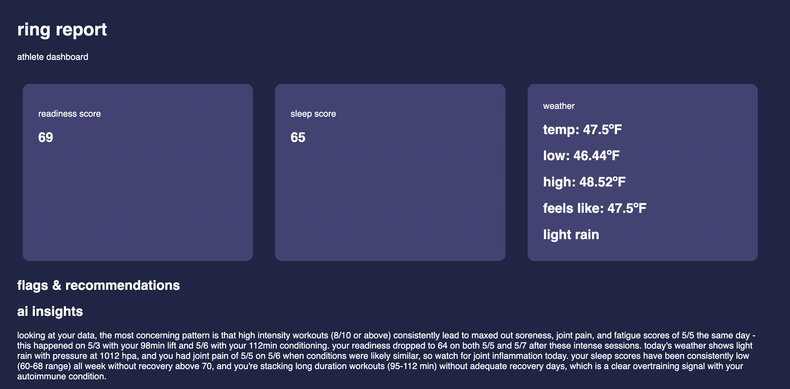
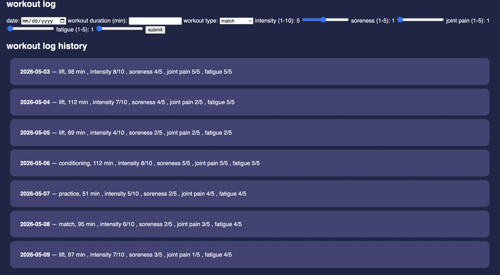

# Ring Report

Personalized recovery dashboard for athletes using Oura ring biometric data to find patterns with weather and training logs to make AI-powered recommendations about future training and recovery. Specifically considers if the athlete has an underlying autoimmune condition, taking into account how potential flares could be affecting fatigue or readiness. 

Live link: https://ring-report.onrender.com \
Website screenshot:   \
Live demo with real data and workout logs: 
https://github.com/user-attachments/assets/19e48a92-b6fb-40e8-ad24-300667c08153

---

## Description

Centralized dashboard that allows athletes to view their readiness and sleep metrics, weather conditions, and log their workouts. The logs are stored in a database including characteristics like duration, type of workout, etc. Considers if the user has an autoimmune condition and makes provides analysis on potential flares or inflammation. Uses AI to find correlation between training based on how specific types of workouts affect the user's readiness and sleep and makes recommendations for the next days training and future ways to recovery after certain workouts. Weather, especially colder temperatures and rain, can lead to flares, so Ring Report also provides insights on how the user is affected by changes in conditions and flags whether to pull back on training based on that.

---

## Features

- Visual display of readiness and sleep scores
- Provides local weather conditions, including current temperature, the low and high for the day, what it feels like, and weather description
- Flags anything concerning, such as dips in readiness and sleep scores or potentially problematic weather conditions
- Shows AI-powered insights on workouts logged and the effects of those on scores
- Makes recommendations for training and sleep based on scores, workouts logged, and barometric pressure
- Allows user to log their workouts, including date, duration, and type of workout
- Sliders for logging daily workout intensity, soreness, joint pain, fatigue, and other notes
- Displays workout log

---

## Tech Stack

- **Backend**: Python, Flask
- **Frontend**: Javascript, HTML, CSS 
- **Database**: SQLite
- **APIs**: Oura API v2, OpenWeatherMap API, Claude API
- **Deployment**: Render

---

## Installation

```bash
git clone https://github.com/audreyfeng13/ring-report.git
cd ring-report
python3.12 -m venv venv
source venv/bin/activate
pip install -r requirements.txt
```

Create a `.env` file with:
```
OURA_TOKEN=your_token
OPENWEATHER_KEY=your_key
ANTHROPIC_KEY=your_key
```

```bash
python app.py
```

Visit `http://127.0.0.1:5001`

If user does not have an Oura token, the app will simulate mock data. 

---

## Learning Journey

As an athlete who was recently diagnosed with an autoimmune condition, I've had to learn my physical limits, as where I had previously reaped benefits from pushing myself extra, it now caused me to get injured or sick. I started using an Oura ring to help my training, but found that the app was not as personalized as I would've liked, as it didn't take into account how my condition could affect my condition, recovery, sorenes, etc. Although there is an AI advisor, I found that its insights were not specific enough and wasn't able to provide the non-generic, personlized insight that I was looking for. I wanted to make something that would be applicable to my personal life and those of other college athletes who have to balance their health with the demands schoolwork and athletics.

This app should reduce the decision fatigue and daily analysis required by athletes, particularly student-athletes, who have already a lot on their minds. Using the power of AI to find patterns within the data collected by a wearable and logged by the user allows the user to find out new correlations between workouts and recovery that they could have missed on their own with little effort on their part. Flagging and making direct recommendations also makes for easier communication with coaches about training, and gives the opportunity for the athlete to be proactive with their training and recovery, rather than waiting to see what potential consequences will happen. By integrating weather conditions, all the data, logs, and recommendations are located in one place, making app use for the user extremely easy. 

During this project, I learned how to write HTMl, CSS, and some Javascript for the frontend, and use Flask for the backend, all of which I had no experience with previously. I had never developed a web service before, having only done projects in class locally or using Streamlit. I chose these because they are fundamental skills for web development, and what I've learned will open up many more opportunities for future projects. All three APIs I used were also new to me, as I have previously only worked with the Reddit API.

---

## Technical Rationale

Because I did not have Javascript experience going into this project and the given the time frame, I chose to use Flask for both the backend and frontend instead of React for the frontend. Being able to use HTML and Python for the frontend as well without learning the syntax and structure of React made this project more feasible for me and allowed me to focus on the ideas and execution. This way, I only had to learn HTML and CSS, and a small amount of Javascript. Additionally, it simplified the build complexity.

The biggest technical tradeoff I had to make was using SQLite instead of PostgreSQL, which prevented me from being able to save the user's database when using the deployed version of the app in Render. Because of this, when the program reloads, the database resets and the user is unable to use workout logs. However, when running the app locally, the database is saved and included in insights as shown in the demo video. 

One of the biggest issues I encountered in general was the use of mock data. Although I started this project with my own personal data, due to privacy reasons and allowing someone without an Oura ring being able test the program, I had to create a data simulator. At first, I created a random generator and ran it twice separately, once for readiness and once for sleep. However, I realized that those two scores are correlated, so I created a method to derive readiness based on the simulated sleep score. Additionally, I was initially also running the random data generation separately for the scores and the insights, so Claude was actually analyzing different data than what was being shown. I fixed this by storing the stored data in variables and calling those when asking Claude to analyze insights. 

I also had issues with the incompatibility of pydantic AI used by Anthropic with Python 3.14, which I was using, so I had to install Homebrew and Python 3.12. Following that, I had to rebuild the virtual environment. 

---

## AI Usage

I used Claude throughot the project as a coding assistant and debugger, in addition to explaining technical concepts. Given that I didn't have any HTML, CSS, or Javascript experience prior to this project and the limited timeframe, much of the syntax was written with Claude. However, I ensured I understood all the code that it gave me. After the initial stages, I wrote more of the code on my own when I had a grasp of the fundamentals. I used it to debug when there were technical errors having to do with language or running the application that I didn't understand. I also used it as an assistant for me to clarify and bounce my ideas off of. 

Although I used AI to help with the technical part, all the ideas, such as what to include in the displays, what to take into account for flags and recommendations, what to include in the workout logs, and using the data simulator and the fixes for the errors those causes among others, all came from me. The architecture and product decisions were my own ideas, and I used Claude to help implement them.  

One specific of a prompt I used was that I wanted to learn how to use AI to flag any concerning signs, rather than hardcoding specific rules. This lead to the integration of the Claude API, which Claude helped me navigate technically. Another example was when I first tried including mock data, and Claude gave me this output: 
    ```python
    _mock_cache = {
        'readiness': generate_mock_data(75),
        'sleep': generate_mock_data(70)
    }
    ```
I adapted this to derive readiness based on sleep, ending up with this code: 
    ```python
    _mock_sleep = generate_mock_data(72)

    def derive_readiness(sleep_data):
        data = []
        for s in sleep_data['data']:
            readiness_score = max(50, min(99, s['score'] + random.randint(-8,8)))
            data.append({"day": s['day'], "score": readiness_score})
        return {"data": data}

    _mock_cache = {
        'sleep': _mock_sleep,
        'readiness': derive_readiness(_mock_sleep)
    }
    ```

---

## Limitations & Future Directions

- Using PostgreSQL instead of SQLite to prevent Render from restarting the workout log database everytime
- Weather data from OpenWeatherMap API is not as accurate as hyperlocal weather forecast
- Incorporating more specific data collected by Oura ring like resting heart rate, HRV, body temperature, and sleep stage data to be passed to Claude
- Ability to edit and delete old workout log entries in Render, rather than only locally
- Full exporting ability for data and recommendations for sharing
- Historical weather correlation through storing past week's weather and seeing correlation with scores and symptom logs, rather than just weather analysis based on the current day's weather
